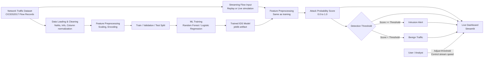

# IDS (Intrusion Detection System) — CICIDS2017 (Cleaned & Preprocessed)

## Overview

This project implements a **Machine Learning–based Intrusion Detection System (IDS)** that detects **malicious network traffic patterns** using the **CICIDS2017 (Cleaned & Preprocessed)** dataset.

The system is designed to be:
- **Reproducible** (train & evaluate from the command line)
- **Explainable** (probability scores + raw features)
- **Interactive** (real-time visualization dashboard)
- **Interview-ready** (clear architecture, metrics, and design decisions)

A trained ML model analyzes network flow records and predicts whether traffic is **benign or malicious**, simulating how a real IDS operates in production environments.

## Dataset
- Kaggle: "CICIDS2017: Cleaned & Preprocessed" (includes `cicids2017_cleaned.csv`)
- You must download via Kaggle API (dataset not committed in this repo due to size (~700MB)).
- Must be placed in data/raws/

## Project Key Features

- Binary intrusion detection (**benign vs attack**)
- High-performance ML pipeline (Random Forest / Logistic Regression)
- Real-time **Streamlit dashboard** for live traffic replay
- Visual alerting with **threshold-based detection**
- Transparent inspection of **raw network flow features**
- Modular, production-style Python project structure

## System Architecture



## Quickstart (PowerShell)

### 1. Create venv + install

```powershell
python -m venv .venv
.\.venv\Scripts\Activate.ps1 (After inputting this line, "(venv)" should appear on the leftmost side of the line)
Install the dependencies
pip install -r requirements.txt
Install the project as a package
pip install -e .
```

### 2. Model Training
Train a Random Forest IDS model:
```powershell
python -m ids.models.train --model random_forest
For faster iteration (recommended during development):
python -m ids.models.train --model random_forest --sample-frac 0.2

Outputs include:
Trained model → models/artifacts/ids_model.joblib
Metadata → models/artifacts/metadata.joblib
Test split → models/artifacts/test_split.csv
```

### 3. Model Evaluation
Evaluate performance on the held-out test set:
```
python -m ids.models.evaluate --threshold 0.5
```
#### Produces:
- Precision / Recall / F1-score
- PR-AUC (Average Precision)
- Confusion Matrix
- Precision–Recall Curve

Saved to reports/figures/

## Live Demo
lets users see the IDS in action.

Run the live dashboard:

```
streamlit run src/ids/demo/dashboard.py

The Dashboard shows:
Real-time streaming of network flows
Attack probability score over time
Threshold-based alerting
Color-coded predictions:
🟢 Benign
🔴 Attack
Raw feature inspection for transparency
```

### Inference API
A FastAPI service is included for deployment-style inference.
```
uvicorn ids.api.app:app --reload

Endpoint: POST /predict

Accepts JSON feature input and returns:
{
  "prediction": "attack",
  "probability_attack": 0.97
}
```

## Design Decisions
#### Threshold-based classification
- Allows tuning sensitivity vs false positives (critical in IDS systems)

#### Flow-based features (not raw packets)
- More scalable and realistic for ML-driven IDS

#### No rolling metrics in dashboard
- Removed intentionally to avoid distracting operators during live monitoring


## Limitations
### Dataset is offline and pre-collected
### Cleaned dataset may be easier than raw traffic
### No temporal correlation between flows
### Binary classification only (no per-attack classifier yet)

## This project can be used to:
### Demonstrate IDS concepts visually
### Teach ML-based cybersecurity
### Serve as a base for research projects
### Showcase ML + security skills in interviews


